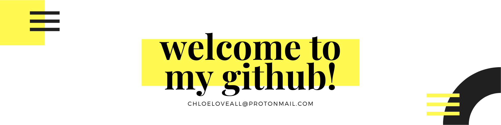
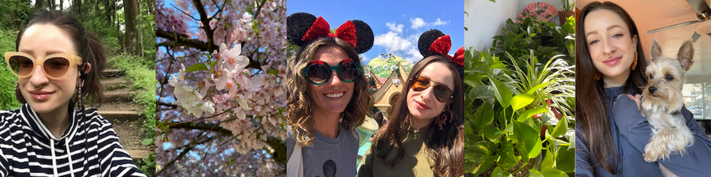

<h1>Hi! I'm Chloe, a software engineer in the Seattle area!</h1>

🟡 &nbsp;My pronouns are  **she** / **her** or **they** / **them**

🟡 &nbsp;I'm a software engineer at <a href="https://www.lightspeedsystems.com">**Lightspeed Systems**!</a>

🟡 &nbsp;I'm a design team volunteer with <a href="https://www.pdxwit.org">**PDX WIT**!</a>

<!-- 🟡 &nbsp;I'm studying **Algorithms & Data Structures**. -->

<!-- 🟡 &nbsp;I'm currently working on <a href="https://www.github.com/chloeloveall/100daysofcode">**#100daysofcode**!</a> -->

<!-- 🟡 &nbsp;I'm currently learning **Angular** and **TypeScript**. -->

🟡 &nbsp;Email me at <a href="mailto:chloeloveall@protonmail.com">chloeloveall@protonmail.com</a>

🟡 &nbsp;Ask me about plants, tattoos, and baby goats... did I mention plants?  

#

<h2>Let's Connect!</h2>

      

#

<h2>Github Stats</h2>

  

#

<h2>Technologies</h2>

                                

#

<!-- <h2>#100daysofcode</h2>

🟡 &nbsp; Here are all of the projects I've built since starting #100daysofcode on 06/01/2021!

🟡 &nbsp; The repo navigation link provides more info - please check it out!   

🟡 &nbsp; **Please Note**: Some project are multi-day and listed more than once.  

<a href="https://let-it-snow.vercel.app/"> <a href="https://quotable-generator.vercel.app/"> <a href="https://tipped-neon.vercel.app/">  <a href="https://vertical-timeline.vercel.app/"> <a href="https://vertical-timeline.vercel.app/"> <a href="https://vertical-timeline.vercel.app/"> <a href="https://vertical-timeline.vercel.app/"> <a href="https://html-css-assessment.vercel.app/"> <a href="https://html-css-assessment.vercel.app/"> <a href="https://github.com/chloeloveall/who-pays"> <a href="https://github.com/chloeloveall/who-pays"> <a href="https://github.com/chloeloveall/bot-me-seymour"> <a href="https://github.com/chloeloveall/bot-me-seymour"> <a href="https://hatchways-grade-book.vercel.app/"> <a href="https://hatchways-grade-book.vercel.app/"> 

 
 
<a href="https://github.com/chloeloveall/100daysofcode/"> 

#

<h2>Coding Challenge Stats</h2>

<table>
  <tr>
    <td>Site</td>
    <td>Rank</td>
    <td>Points</td>
    <td>Languages</td>
  </tr>
  <tr>
    <td><a href="https://edabit.com/user/XT23a68TjWwNE7Qko">Edabit</a></td>
    <td>Level 8</td>
    <td>1580 XP</td>
    <td>JavaScript, Python, C#</td>
  </tr>
  <tr>
    <td><a href="https://cssbattle.dev/player/chloeloveall">CSS Battle</a></td>
    <td>N/A</td>
    <td>2499.12 Total Score</td>
    <td>HTML & CSS</td>
  </tr>
  <tr>
    <td><a href="https://leetcode.com/chloeloveall/">LeetCode</a></td>
    <td>N/A</td>
    <td>65 Points</td>
    <td>JavaScript</td>
  </tr>
  <tr>
    <td><a href="https://coderbyte.com/profile/chloeloveall">CoderByte</a></td>
    <td>N/A</td>
    <td>0 Total Points</td>
    <td>JavaScript</td>
  </tr>
  <tr>
    <td><a href="https://www.hackerrank.com/chloeloveall">HackerRank</a></td>
    <td>N/A</td>
    <td>0 Total Points</td>
    <td>JavaScript</td>
  </tr>
</table>

# -->