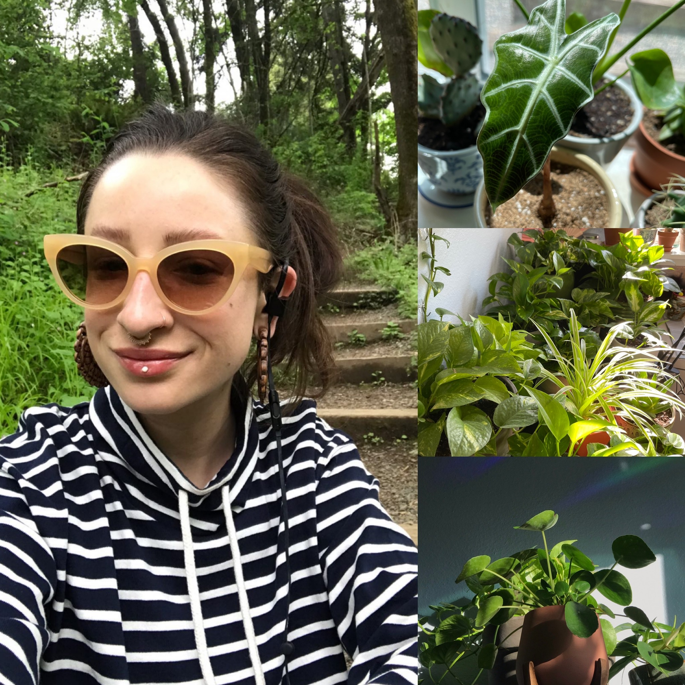

<h1>Hi! I'm Chloe, a software developer in the Seattle area!</h1>

🟡 &nbsp;My pronouns are  **she** / **her** or **they** / **them**

🟡 &nbsp;I'm an intern at <a href="https://www.hubb.me/">**Hubb**!</a>

🟡 &nbsp;I'm looking for help with **Algorithms & Data Structures**.

🟡 &nbsp;I'm currently working on <a href="https://www.github.com/chloeloveall/flora">**my capstone**!</a>

🟡 &nbsp;I'm currently learning **React**, **React Native** and **Sass**.

🟡 &nbsp;Email me at <a href="mailto:chloeloveall@protonmail.com">chloeloveall@protonmail.com</a>

🟡 &nbsp;Find me on <a href="https://www.linkedin.com/in/chloeloveall/">**LinkedIn**!</a>

🟡 &nbsp;Ask me about plants, tattoos, and baby goats... did I mention plants?

#

<h2>Github Stats</h2>

  

#

<h2>Technologies</h2>

    
             

#

<h2>#100daysofcode</h2>

<a href="https://let-it-snow.vercel.app/"> <a href="https://quotable-generator.vercel.app/">